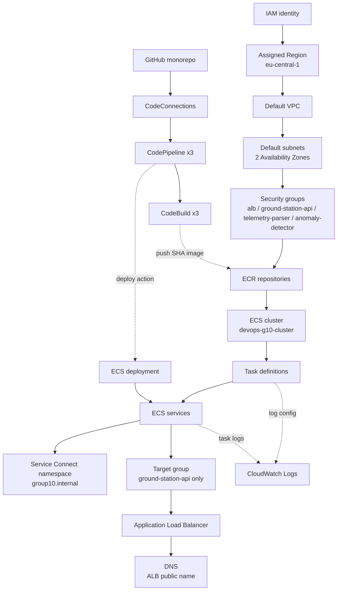

# 1. Dependency Graph & Dependency Questions

> Part of Gate 1 submission — see [README.md](./README.md) for the full folder index.

**Group:** group-10  
**Repo:** github.com/yordanoshagos/devops-satellite-telemetry  
**Region:** eu-central-1  
**Phase:** 1 (paper gate; AWS build started in parallel — see checklist)

We use domain service names (ground-station-api, telemetry-parser, anomaly-detector)
rather than the abstract a/b/c from the scenario. This matches our existing Compose
discovery (`http://telemetry-parser:3002`) and carries over to Service Connect via
discovery names `service-a`, `service-b`, `service-c` in namespace `group10.internal`.

| Scenario role | Our service | App port | Public? |
|---|---|---|---|
| Service A | ground-station-api | 3001 | via ALB only |
| Service B | telemetry-parser | 3002 | no |
| Service C | anomaly-detector | 3003 | no |

Nginx from the local/Docker Compose lab is **not** deployed on ECS. The ALB replaces
Nginx as the public gateway.

---

## 1. Dependency graph

The cloud is a dependency graph; most failures are broken edges. Solid arrows are
the runtime/creation spine. Dotted arrows are observability and delivery.

**Runtime request path** (distinct from the infra graph above):
`client → ALB → ground-station-api → telemetry-parser → anomaly-detector`, then
anomaly-detector → ground-station-api `/callback` (best-effort callback, our
documented C → A edge).

**Edge annotations (what breaks if the edge is missing):**

| Edge | If broken |
|---|---|
| IAM → Region | No authenticated context; nothing can be created |
| VPC → Subnets (2 AZs) | Tasks cannot be placed; ALB needs two AZs |
| Subnets → Security groups | No SG to attach; no traffic enforcement |
| ECR → Cluster | No image to pull at task start |
| Cluster → Task definitions | Nowhere to run tasks |
| Task def → Services | No desired-count controller, no restart/rollout |
| Services → Service Connect ns | No name discovery; ground-station-api cannot reach telemetry-parser by name |
| Services → Target group | ALB has no healthy targets to route to |
| Target group → ALB | No public listener; site unreachable |
| ALB → DNS | No public name for clients |
| Task def → CloudWatch | No logs; health and correlation IDs invisible |
| CodeConnections → Pipeline | Source stage cannot read the repo |
| CodeBuild → ECR | No SHA-tagged image to deploy |
| Pipeline → ECS deployment | Merge does not reach ECS (no hands-off delivery) |

---

## 2. Dependency questions

**What must exist before a Fargate task can start?**  
The cluster, a registered task definition, an execution role with ECR-pull and
CloudWatch-logs permissions, the image present in ECR, subnets in two AZs, a
security group, and the VPC. Public IP assignment is on for the lab so the task
can reach ECR and CloudWatch outbound.

**What must exist before ECS can pull an image?**  
The ECR repository with the SHA-tagged image already pushed, the execution role's
ECR permissions (auth token + pull), a network path out (public IP for outbound
in this lab), and the correct immutable image URI in the task definition.

**What must exist before the ALB can route traffic?**  
The ALB in at least two AZs, an HTTP:80 listener, a target group of type `ip`,
at least one registered ground-station-api target passing its `/health` check, and
SG rules allowing `Internet → ALB:80` and `ALB SG → ground-station-api` on port 3001.

**What depends on the named container port?**  
The Service Connect configuration, the target-group registration (Service A only),
and the container health check all reference the port by its mapping name. The name
must match exactly across the task definition and Service Connect (`service-a`,
`service-b`, `service-c`).

**Which resources survive task replacement?**  
ECR image, task definition revisions, ECS service, cluster, ALB, target group,
security groups, Service Connect namespace, CloudWatch log group, and IAM roles.
The task itself and its IP address do not survive, which is exactly why discovery
is by name and never by task IP.

**Which resources generate cost while idle?**  
Running Fargate tasks and the ALB bill continuously whether or not traffic flows.
CloudWatch Logs bills by ingestion and storage, ECR by image storage, and Container
Insights adds a metrics cost. Security groups, the cluster object, and the default
VPC have no direct cost.
