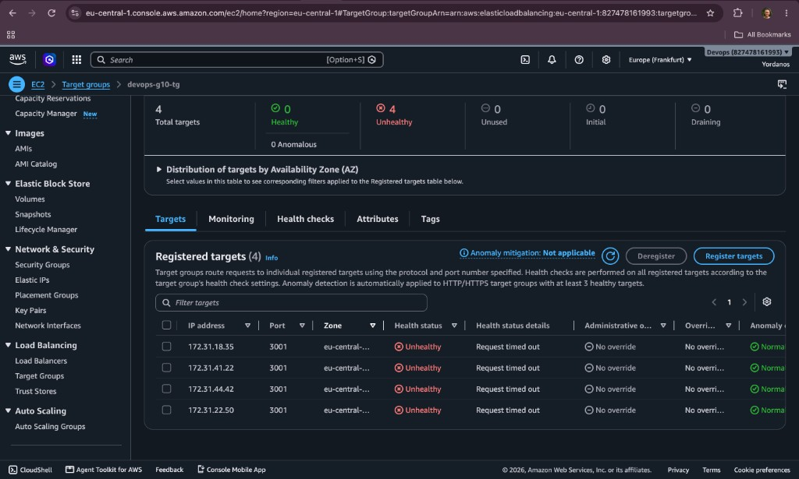
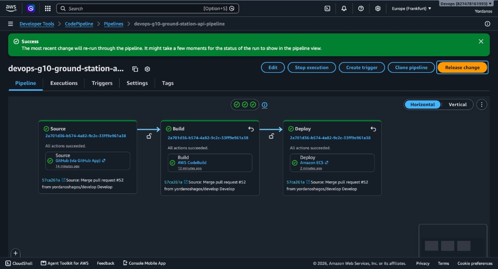
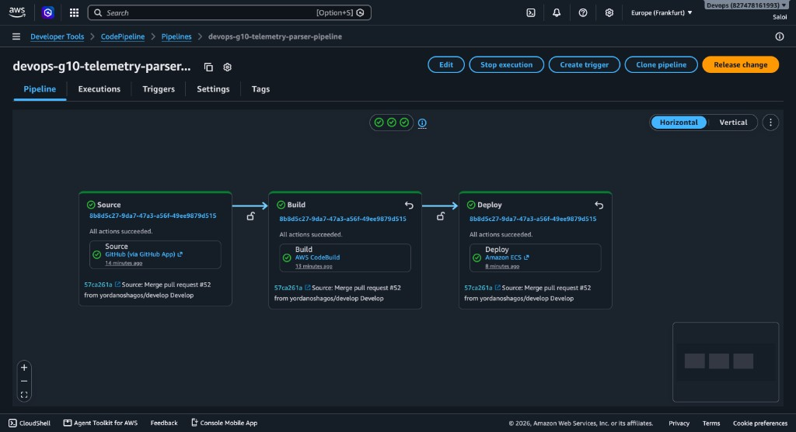
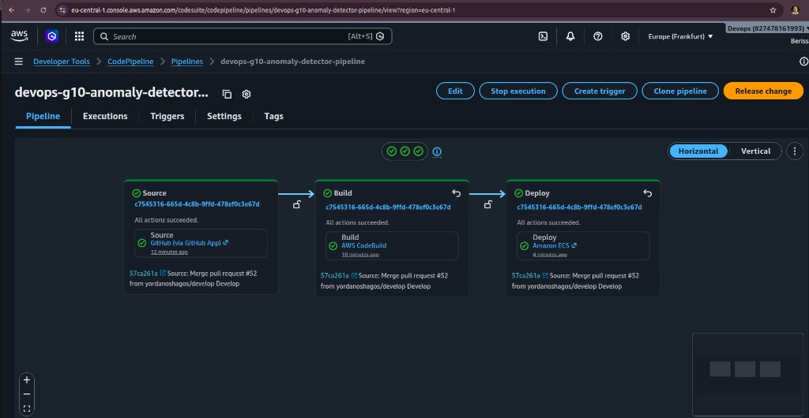

# Scar Log

Record every meaningful failure before repairing it. A clean scar log is not automatically a strong result — evidence quality matters.

| Field | Entry |
|-------|-------|
| Symptom | What failed? |
| First hypothesis | What did you initially suspect? |
| Evidence | What supported or disproved the hypothesis? |
| Actual cause | What was really wrong? |
| Repair | What changed? |
| Prevention | How could it be caught earlier? |

---

## Entries

### SCAR-001 — ECR login on Mac without local AWS CLI

| Field | Entry |
|-------|-------|
| Symptom | `docker push` failed; `zsh: command not found: aws`; Docker reported `password is empty` |
| First hypothesis | ECR credentials or repository permissions were wrong |
| Evidence | `aws` command not found on Mac; login had succeeded only in AWS CloudShell (different machine) |
| Actual cause | AWS CLI was not installed locally; CloudShell Docker login does not apply to the laptop |
| Repair | Installed AWS CLI via Homebrew, ran `aws configure`, retried ECR login on Mac |
| Prevention | Confirm `aws --version` and local `docker login` succeed before building; document that CloudShell ≠ local machine |

### SCAR-002 — Phase 4 bind `127.0.0.1` did not break ALB (Service Connect Envoy)

| Field | Entry |
|-------|-------|
| Symptom | Gate 1 predicted that binding Service A to `127.0.0.1` would make the ALB return 502/503 and mark `devops-g10-tg` unhealthy. After deploying the change, `curl http://$ALB_DNS/health` still returned **HTTP 200** with `status: operational`. |
| First hypothesis | The new image or task definition was not actually rolled out (still running an image bound to `0.0.0.0`), or ALB/target-group health checks were stale. |
| Evidence | Commit `46add89` changed `app.run(host="0.0.0.0")` → `host="127.0.0.1"`; image `sha-46add89` built with `--no-cache` and pushed to ECR; ECS service rolled to task definition `devops-g10-ground-station-api:7` (2/2 running, circuit breaker clean). Fresh ALB response included `server: envoy` and `x-envoy-upstream-service-time`, proving the request path went through Service Connect’s Envoy sidecar, not directly to Flask. |
| Actual cause | With Service Connect enabled, Envoy listens on the task ENI address for port 3001 and proxies to the app on localhost. Binding Flask to `127.0.0.1` only affects the app process; ALB → Envoy → `127.0.0.1:3001` still succeeds. The Gate 1 failure prediction assumed a direct ALB→Flask path and is invalid once Service Connect is in place. |
| Repair | Restore `app.run(host="0.0.0.0", ...)` (do not leave the lab sabotage in the running image), rebuild/push a new `sha-*`, register a new task definition revision, and force a new deployment. Re-check `curl http://$ALB_DNS/health` and target-group health after repair. |
| Prevention | Revisit failure predictions after enabling Service Connect; treat Envoy as part of the data path. Prefer SG / IAM / callback-edge breaks for Phase 4 demos when Service Connect is on. After every deploy, confirm image URI + revision and inspect response headers (`server: envoy`) before concluding a network bind test failed or succeeded. |

### SCAR-003 — Phase 4 remove ALB → Service A security-group rule

| Field | Entry |
|-------|-------|
| Symptom | After deleting the inbound rule on `devops-g10-ground-station-api-sg` that allowed port **3001** from `devops-g10-alb-sg` (`sg-01824ab69da5bea6f`), public access via the ALB failed: `curl http://$ALB_DNS/health` timed out, and target group `devops-g10-tg` showed all targets **Unhealthy** with “Request timed out”. |
| First hypothesis | ALB listener misconfigured, Service A tasks crashed, or wrong security group edited. |
| Evidence | Break: removed only the ALB→A inbound rule on `devops-g10-ground-station-api-sg` (`sg-0febb8eaecaa11840`); left the anomaly-detector callback rule intact. Prove: `curl -i --max-time 10 "http://devops-g10-alb-510630507.eu-central-1.elb.amazonaws.com/health"` → `curl: (28) Operation timed out after 10002 milliseconds with 0 bytes received`. Target group `devops-g10-tg`: **0 healthy / 4 unhealthy**, all on port 3001, health detail **Request timed out** (screenshot below). |
| Actual cause | ALB health checks and user traffic to Service A require SG reference `devops-g10-alb-sg` → `devops-g10-ground-station-api-sg` on TCP 3001. Removing that rule blocked ALB→task packets even though tasks were still running and the C→A callback rule remained. Matches Gate 1 failure prediction for the missing ALB→A edge. |
| Repair | Re-added inbound rule on `devops-g10-ground-station-api-sg`: Custom TCP, port **3001**, source **`devops-g10-alb-sg` (`sg-01824ab69da5bea6f`)**, description `ALB to ground-station-api HTTP`. After restore, `curl -i --max-time 10 "http://$ALB_DNS/health"` returned **HTTP 200** with `status: operational` and `telemetry_parser: reachable` (response still via Envoy: `server: envoy`). |
| Prevention | Treat SG reference rules as the traffic contract; never leave ALB→A removed after the demo. Capture TG health + curl evidence before repairing. Prefer editing one rule at a time so the callback edge is not accidentally deleted. |

**Evidence — target group unhealthy after removing ALB→A SG rule:**



**Evidence — ALB curl timeout:**

```text
ALB_DNS=devops-g10-alb-510630507.eu-central-1.elb.amazonaws.com
curl -i --max-time 10 "http://${ALB_DNS}/health"
curl: (28) Operation timed out after 10002 milliseconds with 0 bytes received
```

### SCAR-004 — Phase 4 remove C → A callback security-group rule (Yordanos + Berissa)

| Field | Entry |
|-------|-------|
| Symptom | After removing the inbound rule on `devops-g10-ground-station-api-sg` that allowed port **3001** from `devops-g10-anomaly-detector-sg`, `POST /telemetry` through the ALB was still accepted, but processing never finished: `/status/...` stayed stuck (not `completed` / awaiting callback). Berissa saw callback failures from Service C toward `service-a:3001`. |
| First hypothesis | Service C bug, wrong callback URL / Service Connect name, or Service A `/callback` handler broken. |
| Evidence | Break: removed only the C→A callback inbound rule on `devops-g10-ground-station-api-sg` (kept ALB→A rule). Prove: `POST http://$ALB_DNS/telemetry` with a request id succeeded (frame accepted / forwarded), but `GET http://$ALB_DNS/status/<id>` did not reach `completed` while the rule was missing; Service C logs showed failure calling the ground-station callback URL. ALB `/health` still worked (ALB→A path intact), isolating the failure to the callback edge. |
| Actual cause | Traffic contract requires `anomaly-detector-sg` → `ground-station-api-sg` on TCP 3001 for C’s `POST /callback`. Without that SG reference, Service Connect can still resolve `service-a`, but the connection is blocked — so A→B→C runs, then C→A callback fails and status never completes. Matches the Gate 1 backup failure prediction for the missing callback edge. |
| Repair | Restored inbound rule on `devops-g10-ground-station-api-sg`: Custom TCP, port **3001**, source **`devops-g10-anomaly-detector-sg`**, description for anomaly-detector callback. Retried telemetry through the ALB; `/status/...` returned **`status: completed`** again. |
| Prevention | Document the C→A callback as an intentional extra edge in the traffic-contract matrix; never delete it when testing ALB→A. After any SG edit, run both `/health` (ALB path) and a full `/telemetry` → `/status` check (callback path) before calling the system green. |

**Break / prove pattern used:**

```text
# After removing C→A SG rule — telemetry accepted, status NOT completed
curl -s -X POST "http://$ALB_DNS/telemetry" \
  -H "Content-Type: application/json" \
  -H "X-Request-ID: scar-callback-001" \
  -d '{ ... }'

sleep 3
curl -s "http://$ALB_DNS/status/scar-callback-001"
# stuck / not completed

# After restoring C→A SG rule — retry with a new request id → status: completed
```

### SCAR-005 — Phase 4 kill-a-task (ECS replaces Service A)

| Field | Entry |
|-------|-------|
| Symptom | Manually stopped one running Service A Fargate task to simulate failure. Momentarily `runningCount` dropped while ECS started a replacement (`desired=2`, briefly `running=1` / `pending=1`). |
| First hypothesis | Stopping a task might take the service permanently down or leave the ALB unhealthy until manual intervention. |
| Evidence | Stopped task `7562403bc51843b1b9c6d9632598a668` with `aws ecs stop-task ... --reason "Phase4 kill-a-task test"`. Mid-recovery: `desired=2`, `pending=1`, `running=1`. After recovery, RUNNING tasks were new ARNs `17aeea45a3f44111bfd7ed971b53b219` and `84ee2d1f97584882a009c976fafd1c17` (killed task gone). ALB still served traffic: `curl http://$ALB_DNS/health` → **HTTP 200**, `status: operational`. |
| Actual cause | Expected ECS service behavior: desired count stays 2; the scheduler replaces stopped tasks automatically. ALB/target group drains the old target and registers the new task once healthy. No manual redeploy required. |
| Repair | None required beyond waiting for ECS replacement. Confirmed service returned to 2 running tasks and ALB `/health` stayed (or returned) healthy. |
| Prevention | Run kill-a-task during demos with desired count ≥ 2 so one task can die without full outage. Always verify both ECS running count and ALB `/health` after a stop. |

**Evidence — stop + recovery:**

```text
# Killed
TASK_ARN=arn:aws:ecs:eu-central-1:827478161993:task/devops-g10-cluster/7562403bc51843b1b9c6d9632598a668
aws ecs stop-task --region eu-central-1 \
  --cluster devops-g10-cluster \
  --task "$TASK_ARN" \
  --reason "Phase4 kill-a-task test"

# Mid-recovery
desired=2  pending=1  running=1

# After recovery — new task ARNs (killed task absent)
17aeea45a3f44111bfd7ed971b53b219
84ee2d1f97584882a009c976fafd1c17

# ALB still healthy
curl -i --max-time 10 "http://devops-g10-alb-510630507.eu-central-1.elb.amazonaws.com/health"
HTTP/1.1 200 OK
status: operational
```

### SCAR-006 — Phase 5 CodePipeline IAM chain (all three services)

| Field | Entry |
|-------|-------|
| Symptom | All three pipelines (`devops-g10-*-pipeline`) failed stage-by-stage after Source succeeded: **Build** could not download source from S3 (`s3:GetObject` denied on `SourceArti/...`); then **Build** could not upload `imagedefinitions.json` (`s3:PutObject` denied on `BuildArtif/...`); then **Deploy** failed with *“The provided role does not have sufficient permissions to access ECS”*. Manual **Start build** on CodeBuild had worked earlier — only pipeline-triggered runs failed. |
| First hypothesis | GitHub connection, buildspec YAML, or ECS service/cluster misconfiguration in the Deploy stage. |
| Evidence | CodeBuild logs showed `AccessDenied` on role `devops-g10-telemetry-parser-codebuild-role` for artifact bucket `devops-g10-codepipeline-artifacts-827478161993`. After fixing S3 on CodeBuild roles, Build succeeded but Deploy failed on `devops-g10-*-pipeline-role`. Each error named a different IAM action and role — pipeline passes artifacts through S3 between stages, so **CodeBuild role** and **pipeline role** need different permissions. |
| Actual cause | Phase 5 uses two IAM roles per service. When CodePipeline runs CodeBuild, source is **not** cloned from GitHub in the build job — it is read from the pipeline artifact bucket. The pipeline role writes Source artifacts and starts CodeBuild; the CodeBuild role must read Source artifacts and write Build artifacts; the pipeline role must read Build artifacts and call ECS (`RegisterTaskDefinition`, `UpdateService`) with `iam:PassRole` to `devops-g10-ecs-execution-role` and `devops-g10-ecs-task-role`. Inline policies added incrementally only fixed one stage at a time. |
| Repair | Added inline policies on all three **`*-codebuild-role`**: `CodeBuildArtifacts` — `s3:GetObject`, `s3:GetObjectVersion`, `s3:PutObject` on `devops-g10-codepipeline-artifacts-827478161993/*` (plus `ListBucket` / `GetBucketLocation` on the bucket). Added inline policies on all three **`*-pipeline-role`**: `CodePipelineArtifactBucket` (S3 read/write for Source/Build artifacts), `CodePipelineStartCodeBuild` (`codebuild:StartBuild`, `BatchGetBuilds`), `CodePipelineECSDeploy` (`ecs:DescribeServices`, `ecs:DescribeTaskDefinition`, `ecs:DescribeTasks`, `ecs:ListTasks`, `ecs:RegisterTaskDefinition`, `ecs:UpdateService`, plus `iam:PassRole` to the two shared ECS roles with `iam:PassedToService = ecs-tasks.amazonaws.com`). **Release change** on each pipeline → Source ✓ Build ✓ Deploy ✓ for all three services. |
| Prevention | Map IAM to pipeline stages before first run: Source → pipeline role S3 write; Build → CodeBuild role S3 read/write + pipeline role StartBuild; Deploy → pipeline role S3 read + ECS + PassRole. Use a checklist per role instead of fixing one 403 at a time. Confirm with a full pipeline run (not only manual CodeBuild). After deploy, verify new `sha-*` tag in ECR and ECS deployment on `devops-g10-cluster`. |

**Permission map (Phase 5):**

| Stage | IAM role | Required actions |
|-------|----------|------------------|
| Source | `*-pipeline-role` | `s3:PutObject` on artifact bucket |
| Build (start) | `*-pipeline-role` | `codebuild:StartBuild`, `codebuild:BatchGetBuilds` |
| Build (run) | `*-codebuild-role` | `s3:GetObject` on `SourceArti/...` |
| Build (output) | `*-codebuild-role` | `s3:PutObject` on `BuildArtif/...` |
| Deploy | `*-pipeline-role` | `s3:GetObject` on build artifact + ECS API + `iam:PassRole` |

**Evidence — typical Build failure (missing S3 read on CodeBuild role):**

```text
error while downloading key devops-g10-telemetry/SourceArti/5Hjk2vk
AccessDenied: ... devops-g10-telemetry-parser-codebuild-role ... s3:GetObject
on arn:aws:s3:::devops-g10-codepipeline-artifacts-827478161993/...
```

**Evidence — typical Deploy failure (missing ECS on pipeline role):**

```text
Error code: Insufficient permissions
Error message: The provided role does not have sufficient permissions to access ECS
Pipeline: devops-g10-telemetry-parser-pipeline
Action execution ID: 4ca76f98-ded0-460e-b060-bfb61a1a57d4
```

**Evidence — all three pipelines green after IAM repair (commit `57ca261a`, PR #52):**

Service A — `devops-g10-ground-station-api-pipeline` (Source → Build → Deploy succeeded):



Service B — `devops-g10-telemetry-parser-pipeline` (Source → Build → Deploy succeeded):



Service C — `devops-g10-anomaly-detector-pipeline` (Source → Build → Deploy succeeded):



