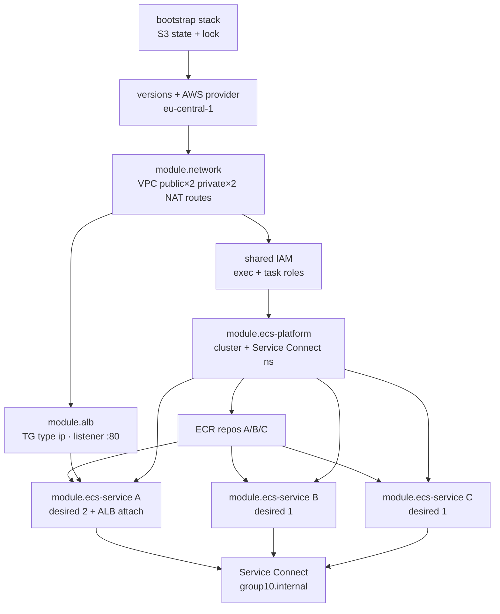

# 1. Dependency graph (IaC greenfield)

**Author:** Arsema (Platform)  
**Reviewer:** Yordanos  
**Group:** 10 · **Region:** `eu-central-1`  
**Tool:** Terraform v1.15.8 · provider `hashicorp/aws ~> 5.0`

This replaces the console-lab dependency graph. Workload runs in a **custom VPC** with **private** Fargate tasks (no public IPs). The old console cluster `devops-g10-cluster` is **out of scope** for this graph and must not be destroyed by IaC.

| Scenario role | Service | Port | Discovery name |
|---|---|---|---|
| Service A | ground-station-api | 3001 | `service-a` |
| Service B | telemetry-parser | 3002 | `service-b` |
| Service C | anomaly-detector | 3003 | `service-c` |

Service Connect namespace (IaC): `group10.internal` (assignment form). Cluster name: `devops-g10-iac-cluster` so it does not collide with the console cluster.

---

## Creation / module dependency graph

**Runtime path:**  
`Internet → ALB :80 → A :3001 → B :3002 → C :3003`  
Documented extra edge (app behaviour): `C → A :3001 /callback`.

---

## What breaks if an edge is missing

| Edge | If broken |
|---|---|
| Bootstrap → workload backend | No remote state / locking; team cannot share plan/apply safely |
| Network → private subnets | Tasks cannot be placed without public IPs |
| Network → NAT / routes | Tasks cannot pull from ECR or write CloudWatch logs |
| IAM exec role → ECR/logs | Tasks fail start (`CannotPullContainerError` or log errors) |
| Platform → cluster / namespace | No place to run services; no `service-b` / `service-c` names |
| ECR → image SHA | Service has nothing immutable to deploy |
| ALB → TG → Service A | Public `/health` and app path fail |
| A SG → B SG | Telemetry parse path fails |
| B SG → C SG | Analyze path fails |
| Missing deny A → C | Security contract fails assessment |

---

## Dependency questions (IaC answers)

**What must exist before a Fargate task can start?**  
Remote state backend, custom VPC, private subnets in 2 AZs, egress (NAT), security group, cluster, task definition with SHA image URI, execution role, image present in ECR, `assign_public_ip = false`.

**What must exist before ECS can pull an image?**  
ECR repo + pushed `sha-<gitsha>` tag, execution role pull permissions, network path from private subnet via NAT to ECR.

**What must exist before the ALB can route traffic?**  
ALB in ≥2 public subnets, listener :80, TG type `ip`, Service A tasks registered and healthy, SG path Internet→ALB and ALB→A:3001.

**Which resources survive task replacement?**  
VPC, subnets, NAT, ALB, TG, cluster, service, task definition family, ECR image, SGs, log groups, IAM roles, state backend. Task ENI/IP do not.

**Which resources cost while idle?**  
NAT Gateway, ALB, running Fargate tasks, CloudWatch ingestion/storage, ECR storage. Empty cluster object is cheap; NAT/ALB are not — destroy after demos.
