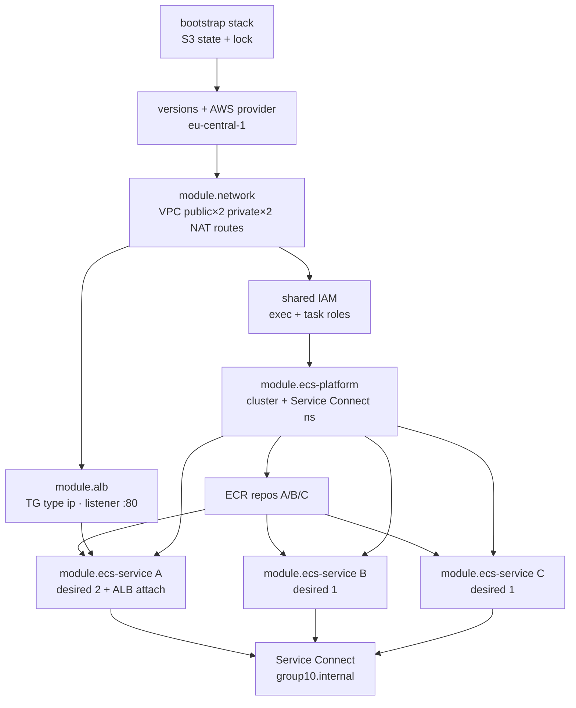

# 1. Dependency graph (IaC greenfield)

Workload runs in a **custom VPC** with **private** Fargate tasks (no public IPs). Old console cluster `devops-g10-cluster` is out of scope — IaC must not destroy it.

| Role | Service | Port | Discovery name |
|---|---|---|---|
| Service A | ground-station-api | 3001 | `service-a` |
| Service B | telemetry-parser | 3002 | `service-b` |
| Service C | anomaly-detector | 3003 | `service-c` |

Service Connect namespace: `group10.internal`  
IaC cluster: `devops-g10-iac-cluster`

## Module dependency graph

**Runtime:** `Internet → ALB :80 → A :3001 → B :3002 → C :3003`  
**Extra app edge:** `C → A :3001 /callback`

## If an edge is missing

| Edge | If broken |
|---|---|
| Bootstrap → workload backend | No shared remote state / locking |
| Network → private subnets | Tasks cannot place without public IPs |
| Network → NAT / routes | Cannot pull ECR or write CloudWatch logs |
| IAM exec role → ECR/logs | Task start fails (`CannotPullContainerError`) |
| Platform → cluster / namespace | No services; no Service Connect names |
| ECR → image SHA | Nothing immutable to deploy |
| ALB → TG → Service A | Public path / health fails |
| A SG → B SG | Parse path fails |
| B SG → C SG | Analyze path fails |
| Missing deny A → C | Security contract fails |

## Dependency questions

**Before a Fargate task can start:** remote state, custom VPC, private subnets in 2 AZs, NAT egress, SG, cluster, task definition with SHA image, execution role, image in ECR, `assign_public_ip = false`.

**Before ECS can pull an image:** ECR repo + `sha-<gitsha>`, exec role pull perms, private subnet → NAT → ECR.

**Before ALB can route:** ALB in ≥2 public subnets, listener :80, TG type `ip`, healthy Service A targets, SG Internet→ALB and ALB→A:3001.

**Survives task replacement:** VPC, subnets, NAT, ALB, TG, cluster, service, task def family, ECR image, SGs, log groups, IAM, state backend. Task ENI/IP do not.

**Costs while idle:** NAT, ALB, running Fargate tasks, CloudWatch, ECR storage. Destroy workload after demos; keep bootstrap bucket.
