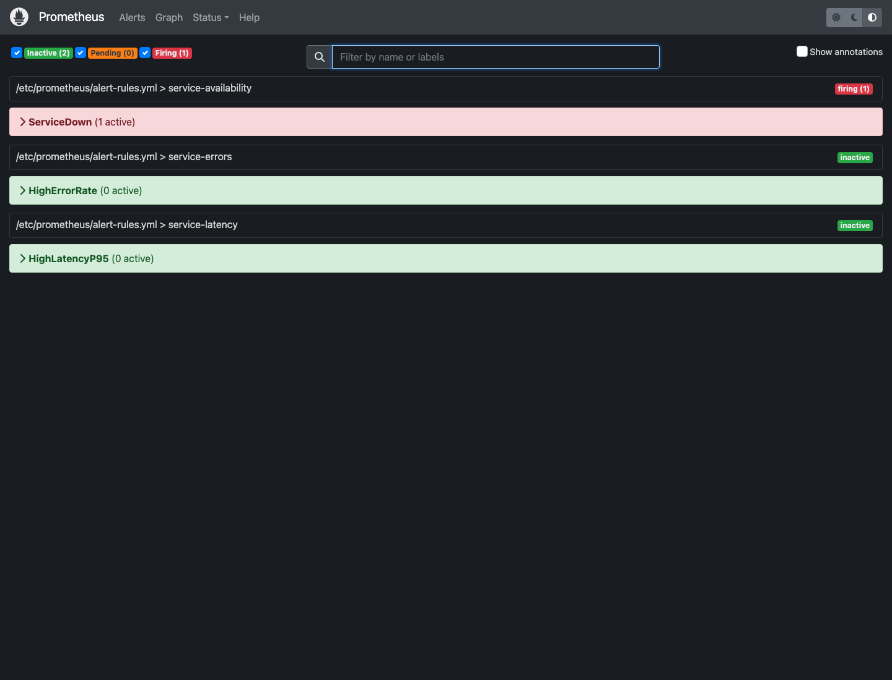
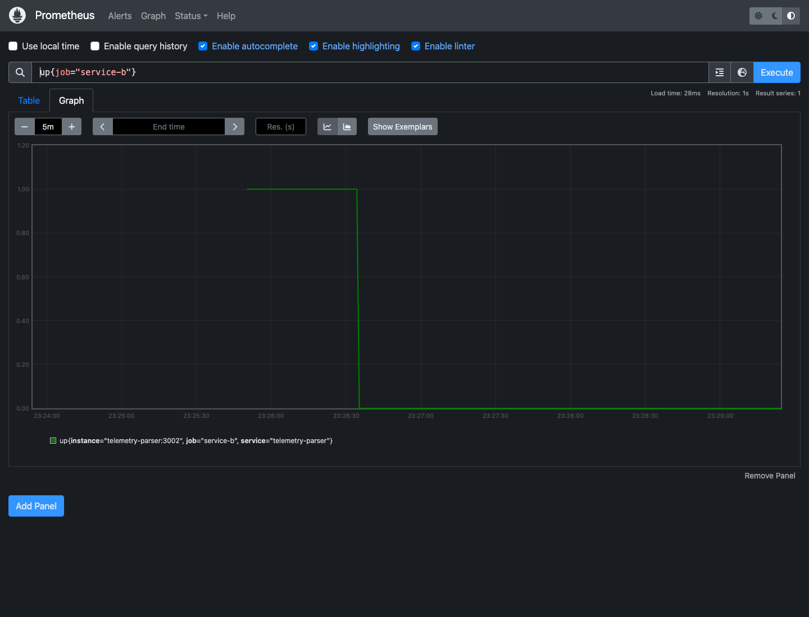
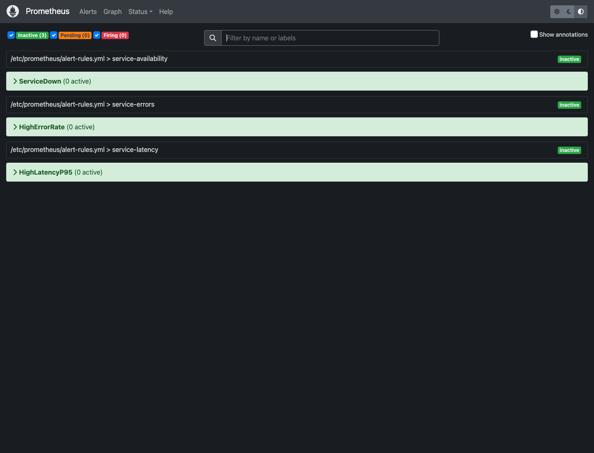
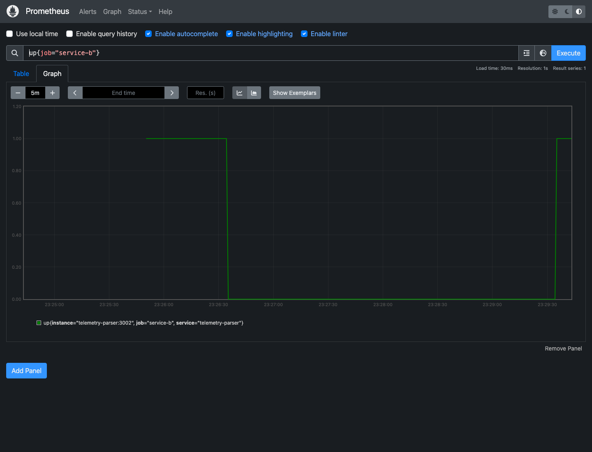
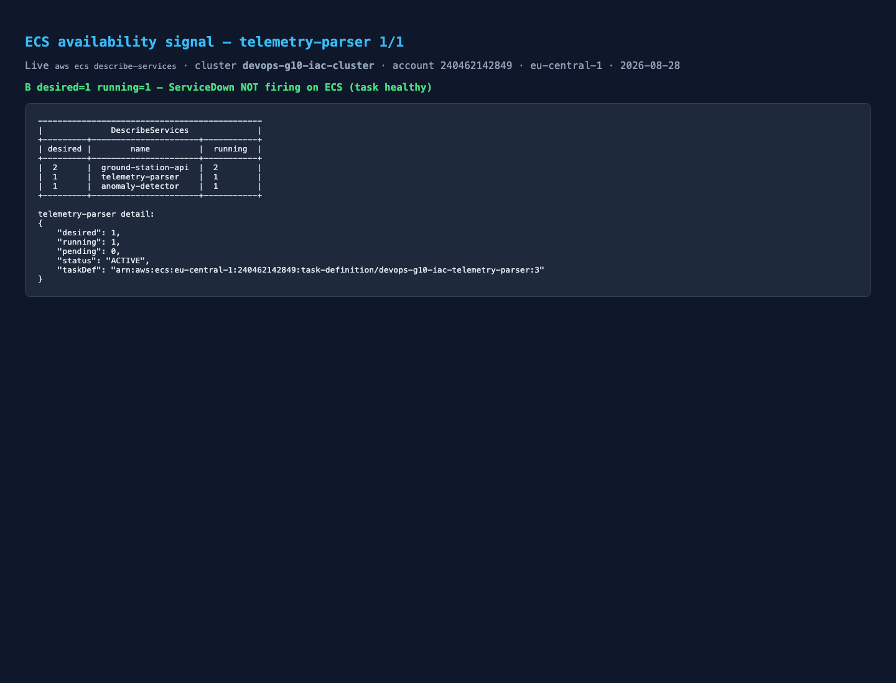

# Service B alerts — Saloi

**Service:** `telemetry-parser` (ECS) / compose job `service-b`  
**Port:** 3002  
**Log group:** `/ecs/devops-g10-iac-telemetry-parser`  
**SG:** `devops-g10-iac-telemetry-parser-sg` (`sg-0140cb7d6e278027f`)

---

## Alert 1 — `ServiceDown` (compose) / B unavailable (ECS)

Rule (compose, [`alert-rules.yml`](../../alert-rules.yml)):

```text
alert: ServiceDown
expr:  up{job=~"service-.*"} == 0
for:   30s
```

Reproduce (compose — captured 2026-08-28 02:29 local):

```bash
docker compose stop telemetry-parser
# wait ~30s until ServiceDown is firing for job=service-b
# evidence: b-servicedown-firing.png
```

Clear:

```bash
scripts/simulate-failure.sh recover
# expect up{job="service-b"} == 1
```

ECS equivalent (do **not** run during someone else’s drill without announcing):

```bash
# Observe only — Day 0 steady state is the “clear” screenshot
aws ecs describe-services --cluster devops-g10-iac-cluster --services telemetry-parser \
  --query 'services[0].{desired:desiredCount,running:runningCount,pending:pendingCount}'
```

### 1. What is wrong?

Prometheus cannot scrape `telemetry-parser:3002/metrics` (`up{job="service-b"}==0`), **or** on ECS the parser task is not running / not reachable from A.

### 2. Why does it matter to the journey?

B is the only parse hop. A does not talk to C. If B is down, `POST /telemetry` returns **502** `Telemetry parser unreachable`. The journey cannot reach C or callback.

### 3. Where do we look first?

| Layer | First look |
|---|---|
| Compose | `docker compose ps` · `docker compose logs telemetry-parser` · Prometheus `up{job="service-b"}` |
| ECS | running 1/1? · events on `telemetry-parser` · image URI + port 3002 · `aws logs tail /ecs/devops-g10-iac-telemetry-parser --since 10m` |
| From the client | `curl "$ALB/health"` — JSON field `telemetry_parser` (ignore HTTP 200; A always returns 200) |

---

## Alert 2 — `HighErrorRate` (when B is the cause)

```text
alert: HighErrorRate
expr:  sum by (service) (rate(http_errors_total[2m])) > 0.1
for:   1m
```

On compose, stopping B makes **A** error (502s), so the firing series may be `service=ground-station-api`, not B. That is still a B-owned incident if `/health` says parser unreachable.

On ECS Day 0 we did **not** page this (no Prometheus on the cluster). Mapping: ALB 5xx on `POST /telemetry` + A logs `forward_to_parser` failure.

### 1. What is wrong?

5xx above 0.1/s for 1m — scrape or dependency errors, or `/fail` lab traffic.

### 2. Why does it matter to the journey?

Ingest is failing for real clients, not just a scrape gap.

### 3. Where do we look first?

A logs for `Telemetry parser unreachable`. Then B running count + B logs. Then SG 3002 from A’s SG.

---

## Alert 3 — `HighLatencyP95` (B hop)

```text
alert: HighLatencyP95
expr:  histogram_quantile(0.95, sum by (service, le) (rate(http_request_duration_seconds_bucket[5m]))) > 0.5
for:   1m
```

Compose reproduce: `scripts/simulate-failure.sh slow` (chain A→B→C `/slow`).

ECS: no Prom histogram yet. Proxy signal = A log `duration_ms` on `telemetry_accepted` / B log `duration_ms` on `parse_complete`. Day 0 parse was `duration_ms: 0` then ~15ms to C — not a latency incident.

### 1. What is wrong?

p95 above 500ms for 1m.

### 2. Why does it matter to the journey?

SLO is p95 < 2s end-to-end. A slow B hop burns the latency budget even if status later completes.

### 3. Where do we look first?

Compose: Jaeger span for `telemetry-parser`. ECS: B logs `duration_ms`; if parse is fast and accept is slow, look at B→C.

---

## ECS availability evidence (Day 0 “clear” / not firing)

Saved: [`b-ecs-availability.txt`](b-ecs-availability.txt)

| Check | Day 0 value |
|---|---|
| desired / running / pending | 1 / 1 / 0 |
| task | `e4c90539e2634117b04043d5ebd1b198` HEALTHY |
| image | `.../devops-g10-iac-telemetry-parser:sha-aeb45210` |
| port | 3002 · Service Connect DNS `telemetry-parser` |
| events | `has reached a steady state` (2026-08-28T01:51:48+03:00) |
| `/health` | `"telemetry_parser":"reachable"` |

---

## Screenshots (captured 2026-08-28)

Compose: `docker compose stop telemetry-parser` → wait until `ServiceDown` firing → `docker compose start telemetry-parser`. Did **not** stop the Fargate task.

**Firing** — Prometheus `/alerts`: `ServiceDown (1 active)` red `firing (1)` after B scrape `up{job="service-b"}==0`.



**Metric** — `up{job="service-b"}` drops to 0 while B is stopped:



**Cleared** — same `/alerts` page after B restart: `ServiceDown (0 active)` green `inactive`, filter `Firing (0)`.



**Recovered scrape** — `up` returns to 1:



**ECS 1/1** — live `describe-services` (not the AWS console UI): A=2 B=1 C=1, `telemetry-parser` running 1 pending 0.



Parse log proof remains in [`b-ecs-availability.txt`](b-ecs-availability.txt) (`parse_complete` + `detector_response_received` for `9b6ab995-…`).

---

## Paste into Arsema’s `alerts/README.md`

| Alert | Tool | Owner | ECS lab signal |
|---|---|---|---|
| `ServiceDown` | Prometheus compose (`up{job="service-b"}`) | Saloi (B) | ECS running 0/1 + `/health` parser not reachable |
| `HighErrorRate` | Prometheus compose | A errors when B is down | ALB 5xx on `POST /telemetry` + A logs |
| `HighLatencyP95` | Prometheus compose | Saloi if B span dominates | B `duration_ms` / no Jaeger on ECS yet |
